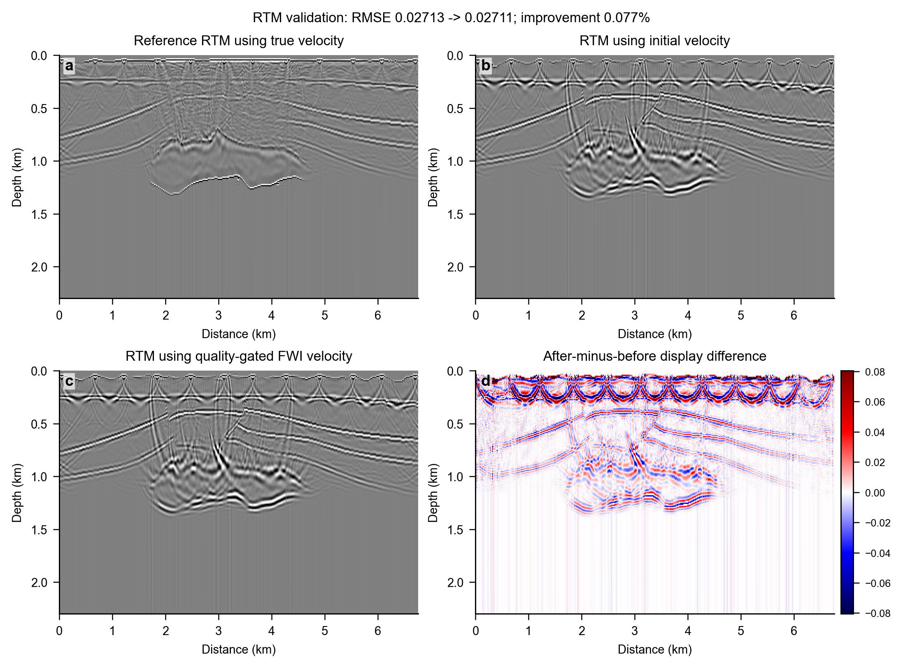
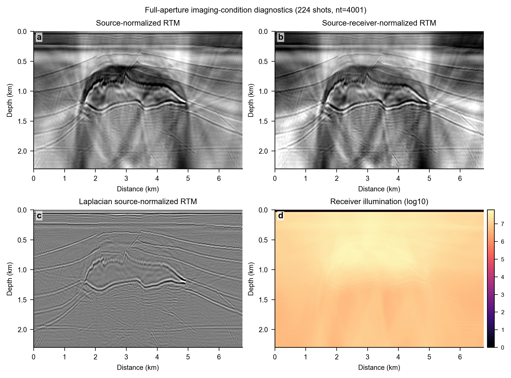
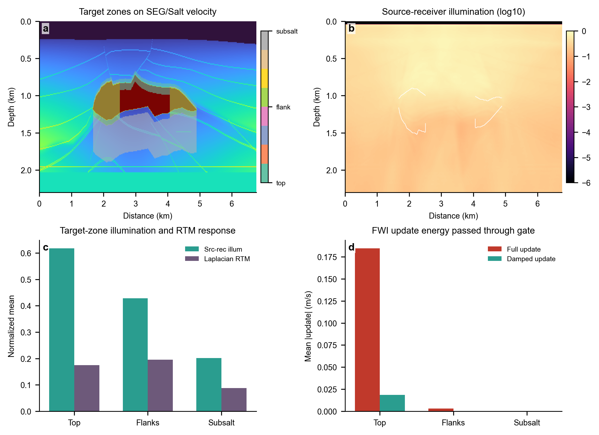

# Salt RTM Imaging

This repository branch contains a standalone reverse-time migration (RTM) project for SEG/Salt-style acoustic imaging experiments. It is separated from the FWI update-admissibility framework so that the code, outputs, and figures here focus only on RTM modeling, migration imaging, illumination normalization, and imaging-condition diagnostics.

## Main Results

### RTM Image Validation



### Imaging-Condition Diagnostics



### Target-Zone Illumination Diagnostics



## Project Layout

- `salt_rtm/acoustic_rtm.py`: acoustic finite-difference modeling and reverse-time migration kernels.
- `salt_rtm/run_seg_salt_rtm.py`: single-shot SEG/Salt RTM demonstration.
- `salt_rtm/run_multishot_rtm.py`: multishot RTM runner.
- `salt_rtm/run_scheme2_imaging_condition_compare.py`: source, receiver, and Laplacian imaging-condition comparison.
- `salt_rtm/run_salt_full_waveform_migration.py`: small-window waveform migration and direct-wave mute scan.
- `docs/figures/`: selected RTM result figures for the project front page.
- `docs/rtm_imaging_condition_metrics.csv`: imaging-condition diagnostic metrics.
- `data/`: local place for SEG/Salt binary velocity models.

## Data

The SEG/Salt binary model is not committed. Put the model at:

```text
data/seg676x230.bin
```

The default model shape used by the runners is `nz=230`, `nx=676`, with `float32` velocity samples unless overridden by command-line arguments.

## Quick Start

Install the Python dependencies in your own environment:

```powershell
python -m pip install numpy matplotlib pytest
```

Run the focused tests:

```powershell
python -m pytest tests -q
```

Run a small RTM example after placing the model file:

```powershell
python -m salt_rtm.run_seg_salt_rtm --model data/seg676x230.bin --output-dir outputs/seg_salt_rtm
```

Run the imaging-condition diagnostic:

```powershell
python -m salt_rtm.run_scheme2_imaging_condition_compare --model data/seg676x230.bin --output-dir outputs/seg_salt_scheme2_smoke
```

## Scope

This branch intentionally excludes FWI update gating, ADMIT audit logic, and FWI result interpretation. It is meant to be used as a clean RTM imaging and wavefield-migration project.
